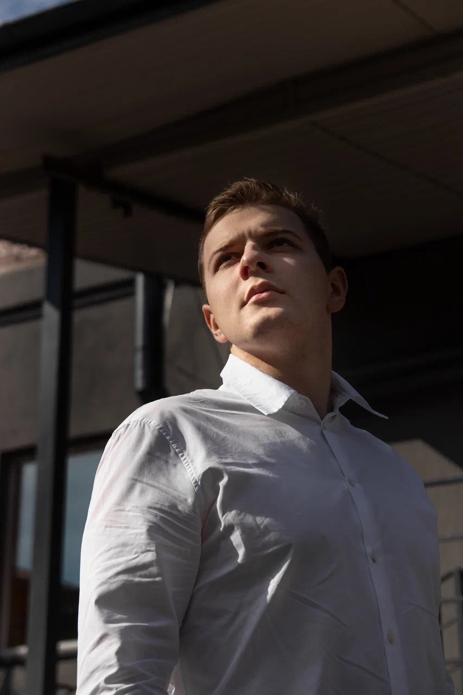

<!-- name -->
# Name
* Dmitry Vadiutin
<!-- photo with circle border -->

<!-- contact info (discord server nickname)-->
# Contact info
* Discord: f1oreo
<!-- goals, strengths, work exp -->
# Goals
* I want to become a web developer
<!-- skills -->
# Skills
* networking
* negotiations
<!-- code examples from codewars using symbols and tags add link to this cv-->
# Code example
``` javascript
    function squareDigits(num){
  let result = num
    .toString()
    .split("")
    .map( num => parseInt(num) )
    .map( num => num * num )
    .join("")
   
  return parseInt(result)
}
```
# Projects
* CV - https://B1tRunner.github.io/rsschool-cv/cv

<!-- work experience -->
* Sales manager
* Marketing specialist
<!-- education -->
##
* BSUIR Bachelor 2020 - exp. 2025
<!-- english level -->
# English
* C1 - Advanced